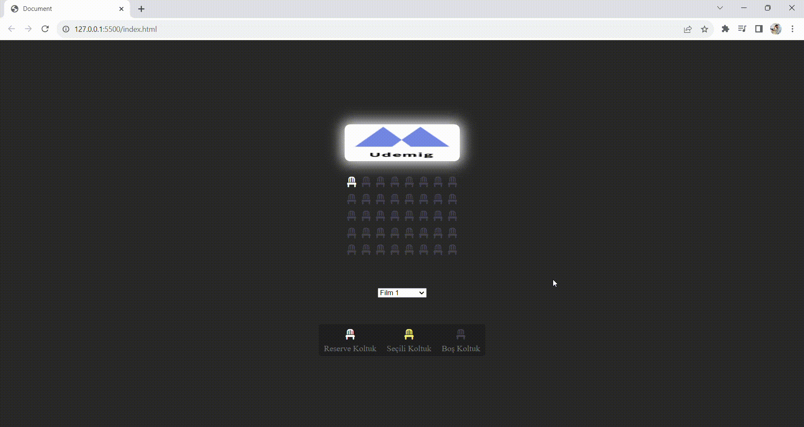

# Cinema Reservation Project
 
This project contains a cinema reservation application developed using JavaScript, HTML, and CSS. This application allows users to select a movie, choose seats, and view reservation details. It also stores and retrieves the selected movie and seat information in the browser's memory when the page is refreshed.

# Project Features
 
- Seat Color Toggle: When users click on a seat, if the seat color matches their chosen color, it turns yellow, and if it's yellow, it reverts to its original color. This function is used to highlight selected seats.

- Info Bar: If no seats are selected, an info bar is not displayed. However, if seats are chosen, an info bar opens, displaying the number of selected seats and the total price.

- Total Price Calculation: As users select seats, the selected seat count and total price are automatically calculated and displayed to the user.

- Memory Retention: The movie and seat information selected by users is stored in the browser's local storage, ensuring that this information is preserved and restored when the page is refreshed.

# Technologies Used
 
This project utilizes the following technologies:

HTML
CSS
JavaScript

